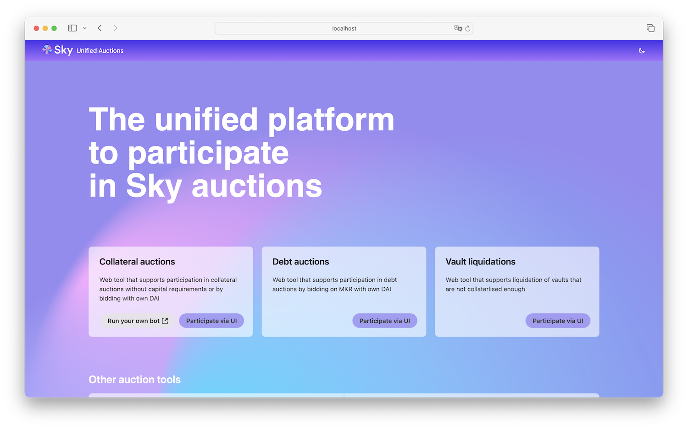

# Unified Auctions UI

The tool to enable easy and straightforward participation in [MakerDAO](https://makerdao.com/) liquidations for users both completely unfamiliar with Maker protocol but also experts. The repository contains both the `frontend`-only application to fetch and manually interact with the maker auctions, as well as the `bot` – the "keeper" application to configure and run with your own settings to automatically particiate in specified auctions.

### Using the app

The frontend app is officially deployed on the [unified-auctions.makerdao.com](https://unified-auctions.makerdao.com/)

### Running locally

Besides being [officially deployed](https://unified-auctions.makerdao.com/) on the public internet, the app can also be run locally in case there are problems with the website avialablility. In order to simplify this process, we packaged the frontend application into the crossplatform electron app.

1. Download relevant application from the [latest github release](https://github.com/sidestream-tech/unified-auctions-ui/releases/latest) page
    - MacOS: download the file ending on `.dmg`
    - Windows: downalod the file ending on `.exe`
    - Ubuntu/linux: download the file ending on `.AppImage`
2. Install the application
    - MacOS
        - Double click the dmg file
        - Drag and drop application icon into the `Applications` folder
        - Important! When opening for the first time:
            - Right click the application in the `Applications` folder, select `Open`
            - Click `Open` while being asked "macOS cannot verify the developer of “Unified Auctions UI.app”. Are you sure you want to open it?"
            - In case of you're seeing other messages, please [follow this official guide](https://support.apple.com/en-gb/guide/mac-help/mh40616/mac)
    - Windows
        - Double click and follow the instructions
    - Ubuntu/linux
        - Make it executable (e.g.: `chmod a+x Unified.Auctions.UI-1.18.1.AppImage`)
        - Run (e.g.: `./Unified.Auctions.UI-1.18.1.AppImage`)
3. Configure RPC URL
    - In order for the application to make requests to the blockchain, fetch auctions, market data and send transactions, it needs the address of a RPC URL. To get this URL, you can use external services like [Alchemy](https://www.alchemy.com/) or [Infura](https://www.infura.io/) or [run your own Ethereum node](https://ethereum.org/en/run-a-node/).
    - Copy the URL and paste it into the dialog window
4. Use [WalletConnect](https://walletconnect.com/) to sign your transactions (other wallets are not currently supported in the electron version)

### Development

Please follow service-level readme instructions inside [frontend](./frontend), [core](./core) and [bot](./bot) folders.

#### Statistics

In order to properly collect statics using plausible.io, we ask developers and company members who need to interact with the production version of the website to opt out of plausible tracking using [those instructions](https://plausible.io/docs/excluding).
