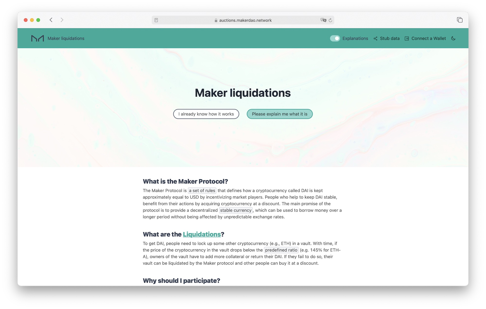

# Unified Auctions UI

The tool to enable easy and straightforward participation in [MakerDAO](https://makerdao.com/) liquidations for users both completely unfamiliar with Maker protocol but also experts.

### Development

#### Environment variables

Please follow service-level readme instructions inside [frontend](./frontend) and [bot](./bot) folders.

NOTE: Environment variables are accessible/available via the `secret` command. Please refer to the [secrets and configuration management guide](https://github.com/sidestream-tech/guides/tree/main/secrets) for more information:

#### Running

```sh
secret export auction-ui/localhost/frontend --format dotenv > ./frontend/.env
cd ./frontend && npm ci && npm run dev
```

### Production/Deployment

#### Statistics

In order to properly collect statics using plausible.io, we ask developers and company members who need to interact with the production version of the website to opt out of plausible tracking using [those instructions](https://plausible.io/docs/excluding).
